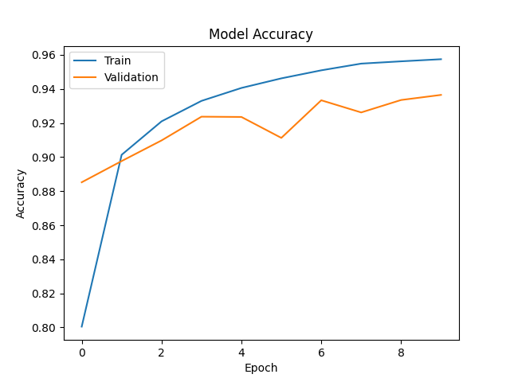
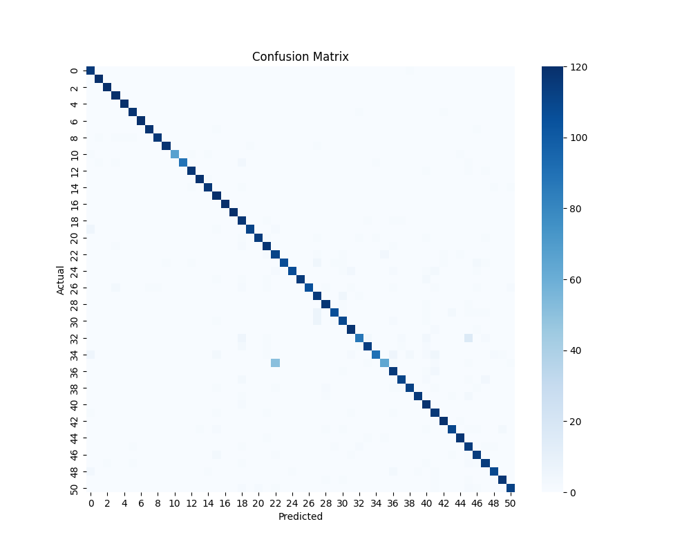
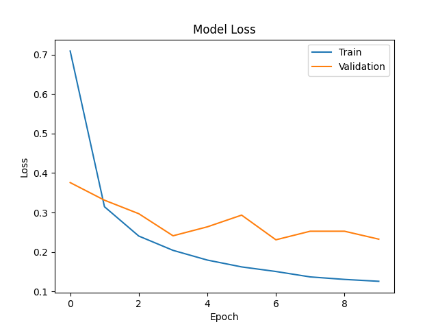

# 🌱 VeggieVibe – Plant & Crop Classification using MobileNetV2

A deep learning project for **classifying Fruits, Plants, Vegetables images** using **TensorFlow and MobileNetV2**.
The model is trained on multiple categories and later converted into **TensorFlow Lite (TFLite)** for future **Flutter mobile app deployment**.

---

# 🚀 Project Overview

This project builds an **image classification model** that can recognize different plant,fruits and crop images.

The workflow of the project:

1. Dataset preparation and splitting
2. Data augmentation
3. Training a deep learning model
4. Evaluating model performance
5. Saving results and graphs
6. Converting the model to **TensorFlow Lite**
7. Preparing it for **future Flutter integration**

---

# 📁 Project Structure

```
Plant-Image-Classifier/
│
├── Models/
│   ├── model.h5
│   └── model.tflite
│
├── Results/
│   ├── accuracy_graph.png
│   ├── loss_graph.png
│   ├── confusion_matrix.png
│   └── classification_report.txt
│
├── train.py
├── data_splitter.py
├── convert_to_tflite.py
├── check_manually_on_image.py
│
├── labels.txt
├── requirements.txt
├── image.jpg
│
└── README.md
```

---

# ⚙️ Technologies Used

* Python
* TensorFlow / Keras
* MobileNetV2 (Transfer Learning)
* NumPy
* Matplotlib
* Seaborn
* Scikit-learn

---

# 🧠 Model Architecture

The model uses **MobileNetV2** as the base model with transfer learning.

Steps:

1. Load pretrained **MobileNetV2 (ImageNet weights)**
2. Freeze base layers
3. Add custom classification layers
4. Train on dataset

Model head:

```
MobileNetV2 (Frozen)
        ↓
GlobalAveragePooling
        ↓
Dense (128, ReLU)
        ↓
Dense (NUM_CLASSES, Softmax)
```

---

# 🧪 Data Augmentation

During training, the following augmentation techniques are used:

* Rotation
* Zoom
* Width Shift
* Height Shift
* Horizontal Flip

All images are also **normalized using**

```
rescale = 1./255
```

Input image size used in training:

```
224 x 224
```

---

# 🏋️ Model Training

To train the model run:

```
python train_model.py
```

Training configuration:

```
Image Size: 224x224
Batch Size: 16
Epochs: 10
Optimizer: Adam
Loss: Categorical Crossentropy
```

After training, the model is saved as:

```
model.h5
```

---

# 📊 Training Results

### Model Accuracy



---

### Confusion Matrix



---

### Loss Graph



---

# 📈 Evaluation Metrics

The project generates the following evaluation outputs:

* Accuracy graph
* Loss graph
* Confusion matrix
* Classification report

The classification report is automatically saved as:

```
classification_report.txt
```

---

# 🔍 Testing on a Custom Image

You can manually test the trained model on a new image.

Run:

```
python check_manually_on_image.py
```

Example output:

```
Top 3 Predictions:
Pumpkin: 0.92
Bottle_Gourd: 0.04
Cucumber: 0.02

Final Predicted Class: Pumpkin
```

The image will also be displayed with the predicted label.

---

# 📱 TensorFlow Lite Conversion

To prepare the model for mobile deployment, the model is converted to **TFLite**.

Run:

```
python convert_to_tflite.py
```

This generates:

```
model.tflite
```

This file will be used inside the future **Flutter mobile application**.

---

# 🏷 Class Labels

The project uses a `labels.txt` file that stores the **class order used during training**.

Example:

```
Apricot
Bean
Bitter_Gourd
Bottle_Gourd
...
Pumpkin
...
Watermelon
```

This file ensures **correct mapping between model outputs and labels**, especially when used inside mobile apps.

---

# 📱 Future Work: Flutter Mobile App

In the future, this project will be integrated into a **Flutter mobile application**.

The Flutter app will:

* Capture image from camera
* Load `model.tflite`
* Load `labels.txt`
* Run on-device inference
* Display predicted plant/crop/fruit/vegetable name

Expected Flutter assets structure:

```
flutter_app/
│
├── assets/
│   ├── model.tflite
│   └── labels.txt
│
├── lib/
│   └── main.dart
```

This will allow **real-time identification directly on a smartphone**.

---

# 📦 Installation

Install dependencies:

```
pip install -r requirements.txt
```

---

# 🧑‍💻 Author

**Ali Raza**

This project was developed as part of a **deep learning  project focused on image classification and mobile AI deployment.**

---

---
